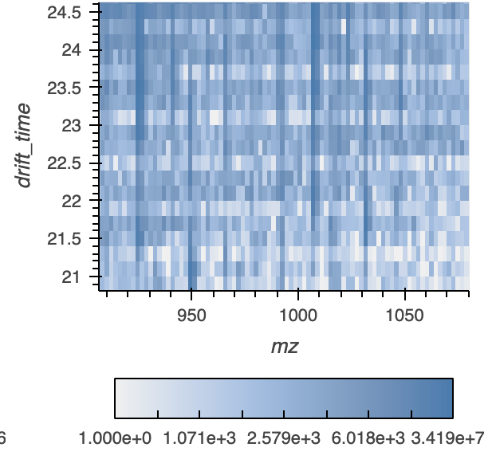
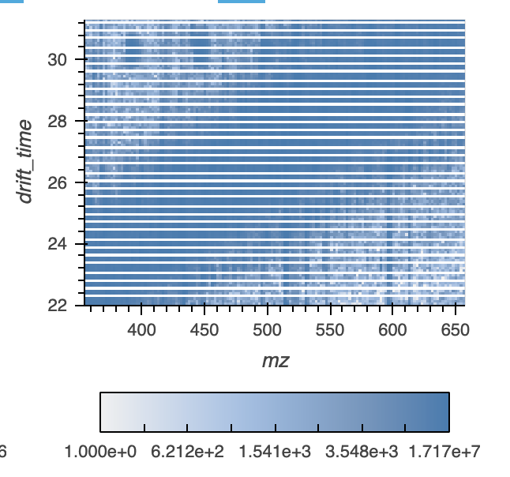

# Selecting Data

Select the files from the folder indicated in the "location of data
folder" folder. The files supported are .h5, .hdf, .mzML, or .mzML.gz 
The h5 files can be made from a dataframe with columns for the 
dimensions and intensity. 
A h5 files can also be created by following the directions
https://deimos.readthedocs.io/en/latest/user_guide/loading_saving.html

The initial data is a placeholder. 
Example data can be found here: https://massive.ucsd.edu/ProteoSAFe/dataset.jsp?task=a407f040a3d3422d94b1dde95fc0178c 

# Smooth data: 

DEIMoS guide:
https://deimos.readthedocs.io/en/latest/user_guide/peak_detection.html

The original data is a placeholder. Unchecking it will run rerun the
function with the selected data.

Click \'Run smooth\' after updating parameters to get new graph.

Keeping the smooth radius small and increasing number of iterations is
preferable to a larger smoothing radius, albeit at greater computational
expense

The new smooth data file will be located in a folder called
"created_data" next to the deimos_gui folder. All other output from the
GUI will be saved here.

This fille will be re-used if the parameter inputs are the same in a
rerun to save computing time.

# Peak data:

DEIMoS guide:
https://deimos.readthedocs.io/en/latest/user_guide/peak_detection.html

Feature detection, also referred to as peak detection, is the process by
which local maxima that fulfill certain criteria (such as sufficient
signal-to-noise ratio) are located in the signal acquired by a given
analytical instrument.

The original data is a placeholder and unclicking it will trigger the
peak function to run.

Click \'Run peak\' after updating parameters to get new graph.

The radius per dimension insures an intensity-weighted per-dimension
coordinate will be returned for each feature

Threshold sets the persistence and persistence ratio

The new peak data file will be located in a folder called "created_data"
next to the deimos_gui folder. All other output from the GUI will be
saved here.

This fille will be re-used if the parameter inputs are the same in a
rerun to save computing time.

MS deconvolution

DEIMoS guide:
https://deimos.readthedocs.io/en/latest/user_guide/ms2_extraction.html

With MS1 features of interest determined by peak detection,
corresponding tandem mass spectra, if available, must be extracted and
assigned to the MS1 parent ion feature.

The original data is a placeholder, clicking with the placeholder will
only return random data.

Click \'Run decon\' after updating parameters to get new graph.

The parameters are the initial data and the peak data created in steps
1-3 in the application.

The MS2 data associated with user-selected MS1 data, with the MS1 data
with the highest intensity used if there are multiple MS1 data points
within a small range of the user-click

The decon file is saved in a folder called "created_data" next to the
deimos_gui file and will be re-used if the parameter inputs are the same
in a rerun to save computing time.

# Calibration

DEIMoS guide:
https://deimos.readthedocs.io/en/latest/user_guide/ccs_calibration.html

The calibrated file will be saved the "created data folder". The data
file must include mz, ccs, charge, and, if not tune mix, a ta column.

The three possible ways to calculate the calibration is to

Load all values:

Make sure calibration input has columns mz, ccs, charge, and ta

file to calibrate\' file has columns mz and drift time

use_tunemix:

Make sure calibration input has columns mz, ccs, and charge

mz, drift_time and intensity in the tune file

mz and drift_time in the \'file to calibrate\'

fixed_parameters:

Provide a beta and tfix value

For all, you can chose to use travelling wave IMS, where the
relationship between measurement and CCS must be linearized by the
natural logarithm, then fit by linear regression.

# Isotopes

DEIMoS guide:
https://deimos.readthedocs.io/en/latest/user_guide/isotope_detection.html

Select a row in the data-frame to view the isotopes and a slice of the
data around the isotopes, with the range of the slices determined by the
user inputs for slice size

# Align

DEIMoS Guide:
<https://deimos.readthedocs.io/en/latest/user_guide/alignment.html>

Update the name of the file to use as the reference

Update the peak folder location and indicate (with \* as the wildcard)
the ending of the files to use.

Alignment is the process by which feature coordinates across samples are
adjusted to account for instrument variation such that matching features
are aligned to adjust for small differences in coordinates

Determine matches within tolerance per feature with the alignment
determined by the kernel by relative or absolute value by support vector
regression kernel.

# Adjust Visualization

## Filtering

Check "set axis width and bin values based on axis below" to filter with
user-input "Axis-width"

If the box isn't checked, zooming is possible via the plot input "zoom"

## Minimum grid size

Min spacing input sets the minimum size of the grid during rasterizing

> 

>
> Output:

Output:

You can zoom into new areas of the chart with the user-input widgets,
and the aggregation and colormap level will automatically update,
allowing you to inspect the data on an overview level or a focused area.
We disabled the re-aggregation when you zoom using the toolbar "zoom" to
only trigger re-aggregation if the user choses to refresh the plots with
the manual axis widths

## Linked Selection

Linked Selection will filter on the underlying data, even if they aren't
used in the plot

## Column Name Selection

The names of the data can be updated here:

If the initial data is mzML, the user needs to select the names from the
file to use as the retention and drift time. If there is not mzML data,
the input here doesn't matter.

The new h5 file created from the mzML file will be located in a folder
called "created_data" next to the deimos_gui folder. All other output
from the GUI will be saved here.

Extra:

"bokeh.core.serialization.DeserializationError: can\'t resolve reference
warning" seem to occur when the align plots are updated. According to
<https://discourse.bokeh.org/t/bug-with-deserializationerror-when-changing-content-layout-in-bokeh-3-1-1/10566>
and <https://github.com/bokeh/bokeh/issues/13229>, it occurs when a
layout is updated with new plots, and it is usually not something to be
concerned about.

## Function Documentation

### run_app.exception_handler(ex)

Return the error value to the user and stop running the code

### *class* run_app.Deimos_app

#### update_param(new_name=None)

With new file folder update the files available in file selector files

#### update_param_cal()

With new file folder update the files available in file selector files for calibration

#### update_mz_accession()

If using mzML allow users to chose name from accession file

#### hvdata_initial()

Start initial data by loading data. Restart if using different file or feature names changed

#### refresh_axis_values()

Let axis ranges based on the data

#### rasterize_md(element, Recreate_plots_with_below_values)

Return rasterized mz and drift retention plot
with x and y range and x and y spacing
Run if steam value of 
Recreate_plots_with_below_values changes

#### rasterize_dr(element, Recreate_plots_with_below_values)

Return rasterized drift time vs retention time plot
with x and y range and x and y spacing
run if steam value of 
Recreate_plots_with_below_values changes

#### rasterize_rm(element, Recreate_plots_with_below_values)

Return rasterized retention time vs mz plot
with x and y range and x and y spacing
Run if steam value of 
Recreate_plots_with_below_values changes

#### hvplot_md(ds)

Return initial points plot mz and drift retention plot

#### hvplot_dr(ds)

Return initial points drift time vs retention time plot

#### hvplot_rm(ds)

Return initial points drift time vs retention time plot

#### initial_viewable(\*\*kwargs)

Full function to return the initial data in three graphs

#### reset_xy_stream()

Reset streams from hvplots so reset isn’t set at original data range

#### create_smooth_data()

#### smooth_viewable(\*\*kwargs)

Full function to load and process smooth function 
If users already has peak data, this step can be skipped
return three graphs and smooth_data.h5 in created_data

#### create_peak_data()

Get peak data using deimos functions
Saves the peak value and changes the file name in the user inputs to new peak file name
Return the peak data to make the graphs

#### peak_viewable(\*\*kwargs)

Run full function to load smooth data, run peak function and return heatmaps

#### ms2_decon()

Get the deconvoluted file
using ms1 and ms2 data from the orignal file and peak file
Returns decovuluted file ending in \_res.csv in created_data folder

#### hvplot_md_decon(ds)

Plot for mz vs drift

#### hvplot_dr_decon(ds)

Plot for drift vs retention time

#### hvplot_rm_decon(ds)

Decon plot for retention time vs mz

#### hvplot_mi_decon(ds)

Plot for mz vs intensity decon

#### function_return_m2_subset_decon(ds, m1, d1, d2, r2, r3, m3)

Plot for mz vs intensity deconvolution
Inputs are the selected values from the three scatter plots
If there is no data associated with the scatter plot values, 
returns random graph with small values so it’s obvious it’s not real
Otherwise select the highest intensity of the selction, and return the ms2 decon values

#### decon_viewable(\*\*kwargs)

Main function to get the deconvolution values from peak and initial data

#### rasterize_md_iso(element, Recreate_plots_with_below_values_iso)

Aggregrate by grid for mz vs drift plot
with x and y range and x and y spacing
Run if steam value of 
Recreate_plots_with_below_values_iso changes

#### rasterize_dr_iso(element, Recreate_plots_with_below_values_iso)

Aggregrate by grid for drift vs retention plot 
with x and y range and x and y spacing
Run if steam value of 
Recreate_plots_with_below_values_iso changes

#### rasterize_rm_iso(element, Recreate_plots_with_below_values_iso)

Aggregrate by grid for retention vs mz plot 
with x and y range and x and y spacing
Run if steam value of 
Recreate_plots_with_below_values_iso changes

#### refresh_axis_values_iso()

Reset the manual filter to the min and max values from the input data

#### get_isotype()

Get the isotopes dataframe from input values of the peak data file
Isotope dataframe will be save in created_data ending in isotopes.csv

#### get_ids(table, index)

Return a slice of the ms1 data based on user input of range 
and the mz values of selected row in table

#### hvplot_datatable_iso(ds)

Return datatable with isotope values for isotopes

#### hvplot_md_iso(ds)

Return scatter plot with mz vs drift for isotopes

#### hvplot_dr_iso(ds)

Return scatter plot with drift vs retention time for isotopes

#### hvplot_rm_iso(ds)

Return scatter plot with retention time vs mz time for isotopes

#### hvplot_mi_iso(ds)

Return spike plot for mz values and intensies from row selected by the user

#### get_ms1()

Load ms1 data whenever either placeholder or rerun button is clicked

#### iso_viewable(\*\*kwargs)

Main function to view the isotopes and if the user clicks on the isotopes table row, 
to see the ms1 data and the mz data from that row

#### calibrate()

Return the calibrated values from the user input in created_data folder
depending on the type of calibration chosen by the user

#### hvplot_datatable_calibrate(ds)

Return points plot of reduced ccs vs arrival time

#### calibrate_viewable(\*\*kwargs)

Main calibrate function to rerun calibration value
Return plot with reduced ccs to ta
and file with calibrated values in the created_data folder

#### name *= 'Deimos_app'*

### *class* run_app.Align_plots

#### update_param(new_name=None)

update the files selectable by the user after the folder updates

#### viewable()

Align the folder in peak folder with the reference folder
Returns: 
\* plots showing the alignmnent
\* csv files to create the plots ending in matchtable.csv
\* \_xy_drift_retention_time.csv
csv file ending in alignment.csv with aligned drift and retention time
# additional_functions module

### additional_functions.exception_handler(ex)

### additional_functions.load_mz_h5(file_name_initial, key, columns, rt_name=None, dt_name=None, new_name=None)

Load either mz, h5 or csv file

> Args:
> : file_name_initial (path): file path to data
>   key (str): key for uploaded data, such as ms1 or ms2
>   columns (list): list of the feature names to return from file
>   rt_name (list): name retention time accession if using mzML file
>   dt_name (list): name drift time accession if using mzML file

> Returns:
> : pd DataFrame with data

### additional_functions.load_initial_deimos_data(file_name_initial, feature_dt, feature_rt, feature_mz, feature_intensity, rt_name, dt_name, new_name=None, key='ms1')

Full function to return dataframe with load_mz_h5

> Args:
> : file_name_initial (path): file path to data
>   feature_dt (str): drift time name
>   feature_rt (str): retention time name
>   feature_mz (str): mz name
>   feature_intensity (str): intensity name
>   key (str): key for uploaded data, such as ms1 or ms2
>   rt_name (list): name retention time accession if using mzML file
>   dt_name (list): name drift time accession if using mzML file

> Returns:
> : pd DataFrame with data

### additional_functions.create_smooth(file_name_initial, feature_mz, feature_dt, feature_rt, feature_intensity, smooth_radius, smooth_iterations, new_smooth_name, rt_name, dt_name)

Get the smooth data

> Args:
> : file_name_initial (path): file path to data
>   feature_dt (str): drift time name
>   feature_rt (str): retention time name
>   feature_mz (str): mz name
>   feature_intensity (str): intensity name
>   radius (float or list): Radius of the sparse filter in each dimension. Values less than
>   zero indicate no connectivity in that dimension.
>   iterations (int): Maximum number of smoothing iterations to perform.
>   new_smooth_name (str): name of new smooth data
>   rt_name (list): name retention time accession if using mzML file
>   dt_name (list): name drift time accession if using mzML file

> Returns:
> : pd DataFrame with data

### additional_functions.create_peak(file_name_smooth, feature_mz, feature_dt, feature_rt, feature_intensity, threshold_slider, peak_radius, index_ms1_peaks, index_ms2_peaks, new_peak_name, rt_name=None, dt_name=None)

Get the smooth data

> Args:
> : file_name_smooth (path): file path to data
>   feature_dt (str): drift time name
>   feature_rt (str): retention time name
>   feature_mz (str): mz name
>   feature_intensity (str): intensity name
>   threshold_slider (int): threshold data with this value
>   index_ms1_peaks (dict) Index of features in original data array.
>   index_ms2_peaks (dict) Index of features in original data array.
>   peak_radius (float, list, or None) If specified, radius of the sparse weighted mean filter in each dimension.
>   Values less than one indicate no connectivity in that dimension.
>   new_peak_name (str): name of new peak data
>   rt_name (list): name retention time accession if using mzML file
>   dt_name (list): name drift time accession if using mzML file

> Returns:
> : pd DataFrame with data

### additional_functions.align_peak_create(full_ref, theshold_presistence, feature_mz, feature_dt, feature_rt, feature_intensity)

Get the smooth data

> Args:
> : full_ref (path): file path to data
>   threshold_presistence (int): initial threshold presistence
>   feature_dt (str): drift time name
>   feature_rt (str): retention time name
>   feature_mz (str): mz name
>   feature_intensity (str): intensity name

> Returns:
> : pd DataFrame with data

### additional_functions.offset_correction_model(dt_ms2, mz_ms2, mz_ms1, ce=0, params=[1.02067031, -0.02062323, 0.00176694])

Function to correct putative pairs while running the deconvolution function

### additional_functions.rasterize_plot(element, feature_intensity, x_filter=None, y_filter=None, x_spacing=0, y_spacing=0)

Get rasterized plot

> Args:
> : element: graph object
>   feature_intensity (str): intensity value
>   x_filter (tuple): x range
>   y_filter (tuple): y range
>   x_spacing (flt): min size of grids
>   y_spacing (flt): min size of grids

> Returns:
> : pd DataFrame with data

### additional_functions.new_name_if_mz(mz_file_name)

### additional_functions.aligment(two_matched, ref_matched, two_matched_aligned, dim, kernel, parameter_inputs)

Save the aligned data

> Args:
> : two_matched (df): dataframe to be aligned
>   ref_matched
>   two_matched_aligned: dataframe output with aligned dimensions
>   dim: dimensions to align
>   kernel: the kernel to use for alignment,
>   parameter_inputs: str to use in saving csv files

> Returns:
> : xy_drift_retention_time: pd DataFrame aligned dataframe 
>   matchtable reference line

### additional_functions.get_peak_file(file_name_initial, feature_dt, feature_rt, feature_mz, feature_intensity, rt_name, dt_name, theshold_presistence, key='ms1')

load the peak files for alignment

> Args:
> : file_name_initial (path): file path to data
>   feature_dt (str): drift time name
>   feature_rt (str): retention time name
>   feature_mz (str): mz name
>   feature_intensity (str): intensity name
>   key (str): key for uploaded data, such as ms1 or ms2
>   rt_name (list): name retention time accession if using mzML file
>   dt_name (list): name drift time accession if using mzML file
>   threshold: int: minimum value of intensity

> Returns:
> : pd DataFrame with peak data, name of new h5 if created from mzML file

### additional_functions.decon_ms2(ms1_peaks, ms1, ms2_peaks, ms2, feature_mz, feature_dt, feature_rt, require_ms1_greater_than_ms2, drift_score_min)

return ms2 decon values

> Args:
> : ms1_peaks: data file of ms1 peaks
>   ms1: data file of ms1 data
>   ms2_peaks: data file of ms2 peaks
>   ms2: data file of ms2 data
>   feature_dt (str): drift time name
>   feature_rt (str): retention time name
>   feature_mz (str): mz name
>   require_ms1_greater_than_ms2 (boolean): ms1 must be greater than ms2 when constructing putative pairs
>   drift_score_min (boolean): only keep drift score greater than .9

> Returns:
> : pd DataFrame with data
